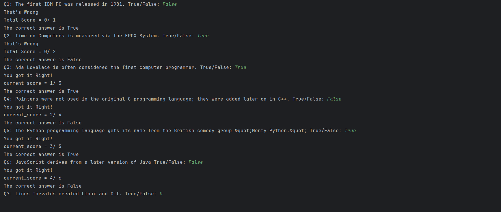

# Python Quiz Game

A simple command-line quiz game built using Python and Object-Oriented Programming (OOP).

## Screenshot



## Features

- Multiple-choice quiz
- Keeps track of the score
- Displays the final score
- Easy to add more questions

## Technologies Used

- Python 3
- Object-Oriented Programming (OOP)

## Project Structure

```
Python-quiz-game/
│── main.py
│── data.py
│── quiz_brain.py
│── question_model.py
```

## How to Run

1. Clone the repository

```
git clone https://github.com/KavyaSharma77/Python-quiz-game.git
```

2. Open the project folder

3. Run

```
python main.py
```

## Author

Kavya Sharma
